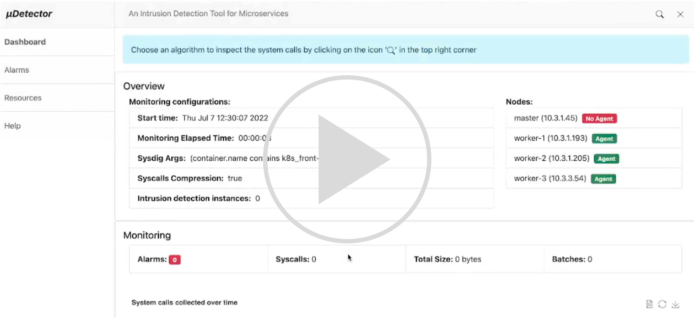

# μDetector

μDetector is an Intrusion Detection Tool for Microservices written in Python. 

## What is it?
μDetector is a tool that relies on proof-of-concept techniques of Intrusion Detection and automates their functioning for Kubernetes and KubeEdge deployments. In practice, after the user has provided a configuration, the tool uses monitoring agents to automatically collect system calls from the desired containers and transfers them over to the Intrusion Detection module of the tool. This module covers all the stages of anomaly-based intrusion detection and all activity classified as anomalous will trigger alarms in real-time indicating a possible intrusion in the microservices’ application. The user can interact with the tool and its monitoring capabilities through a command-line interface or a web dashboard.

To know more about each component click the following link:

- [https://micro-sec.github.io/detector](https://micro-sec.github.io/detector)

## Installation
Pre-requisites include a kubernetes cluster setup (for example [TeaStore](https://github.com/DescartesResearch/TeaStore) or [Sockshop](https://github.com/microservices-demo/microservices-demo)), sysdig (v0.28.0) and a redis server installed and configured

```bash
git clone https://micro-sec.github.io/detector
cd detector
python3 -m pip install -r requirements.txt
python3 -m pip install -e .
```

## Usage

```python
# On the master node of the cluster
kubeproxy
python3.8 daemon/main.py

# On the worker nodes of the cluster
python3.8 agent/main.py

# On the local machine that runs the tool
python3.8 detector/main.py
```
Use the CLI or access the Web Dashboard at http://localhost:5001/

Tip: Consider using tmux sessions


### Video Demonstration

[](docs/assets/detector_demo.mp4)


## Publications

[1] Miguel Teixeira. µDetector: An Intrusion Detection Tool for Microservices. MSc thesis. 2022. 

[2] Flora, J., Teixeira, M., Antunes, N., "µDetector: Automated Intrusion Detection for Microservices." 2023 IEEE International Conference on Software Analysis, Evolution and Reengineering (SANER). IEEE, 2023. [https://ieeexplore.ieee.org/document/10123583](https://ieeexplore.ieee.org/document/10123583)


## About

The work presented in this thesis was carried out within the Software and Systems Engineering (SSE) group of the Centre for Informatics and Systems of the University of Coimbra (CISUC)

This work is partially supported by the project AIDA: Adaptive, Intelligent and Distributed Assurance Platform FCT (CMU-PT) (POCI-01-0247-FEDER-045907), co-funded by the Portuguese Foundation for Science and Technology (FCT) and by the Fundo Europeu de Desenvolvimento Regional (FEDER) through Portugal 2020: Programa Operacional Competitividade e Internacionalização (POCI).

This work has been supervised by Prof. Nuno Antunes and José Flora, and presented to the Department of Informatics Engineering of the Faculty of Sciences and Technology of the University of Coimbra.

